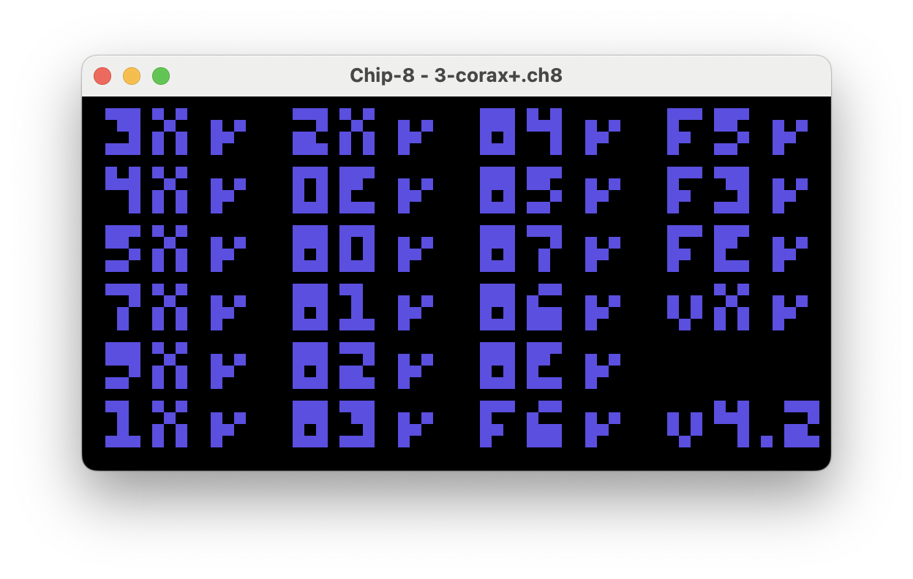
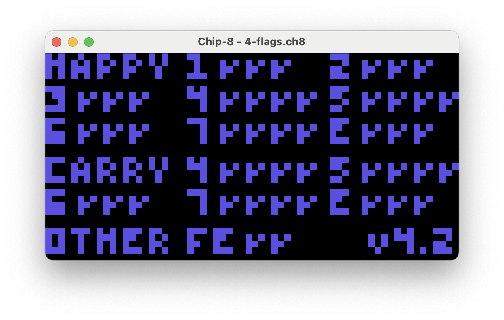

# Chip-8 Emulator

This is a basic [CHIP-8](https://en.wikipedia.org/wiki/CHIP-8) emulator written in Rust.

There are 2 crates in here:

1. `chip8-core`: This builds the core VM and components to execute instructions, including instruction decoding/execution, keypad, and memory management.
2. `chip8`: Uses the VM in the `core` crate to execute instructions. Uses a mix of the [winit](https://github.com/rust-windowing/winit) and [pixels](https://crates.io/crates/pixels) crates to render the display and handle keyboard input.

## Tests

**[Corax+ Opcode Test](https://github.com/Timendus/chip8-test-suite/blob/main/src/tests/3-corax%2B.8o)**

**[Flags Test](https://github.com/Timendus/chip8-test-suite/blob/main/src/tests/4-flags.8o)**

## Notes

- Most instructions are based on the guidance on [this guide](https://tobiasvl.github.io/blog/write-a-chip-8-emulator/)
- This is my first real project in Rust so there's likely plenty of improvements to make on the codebase. Feedback welcome!
- There are a few sample roms included in here but most things were tested again the [chip8 test suite](https://github.com/Timendus/chip8-test-suite).

### TODO

- [ ] Support the Beep sound
- [ ] Support various quirks